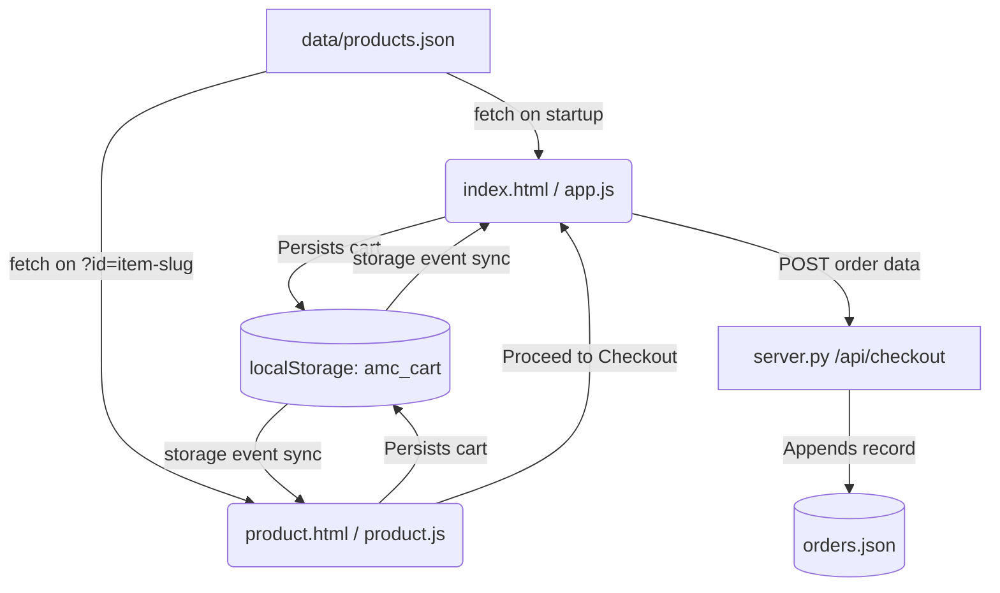

# Mon Chaise (মঞ্চাইছে) — Comprehensive Site Architecture & Specification
> **For LLM Architectural & Code Review**
> **Repository:** `amarmonchaise` | **Date:** September 2026 | **Version:** 2.0 (Dynamic Catalog & Multi-Photo Gallery Edition)

---

## 1. Executive Summary & Brand Identity

**Mon Chaise (মঞ্চাইছে)** is an artisanal, whimsical bilingual e-commerce storefront celebrating indigenous craftsmanship, handloom textiles, 90s nostalgia, and quirky Bangladeshi curios.

### Brand Naming & Philosophy
- **Store Name (English Standard):** **Mon Chaise** (used across all titles, copy, URLs, dictionaries, and legal documents).
- **Store Name (Bengali):** **মঞ্চাইছে** (Chakma/Bengali transliteration).
- **Stylized Logotype:** **Mon Chaiſe** — the archaic 18th-century long-s (`ſ`, U+017F) is strictly reserved for logotype headers and brand badges styled with `font-fell italic`.
- **Primary Slogan:** *"যা মন চায় বেচি"* ("We sell whatever our heart desires").
- **Secondary Slogan:** *"যার যা, যেমনে মন চায়"* ("To each their own, however the heart pleases").
- **Aesthetic Philosophy:** Inspired by Chittagong Hill Tracts backstrap waist-loom weaves (*Thami*), 18th-century printing press typography, and traditional nakshikantha stitching. **Zero modern tech-glow, zero radial neon orbs, zero gradients in light mode.**

---

## 2. Directory & File Hierarchy

```text
amarmonchaise/
├── index.html                  # Main storefront: hero, categories, search, 2x2 grid, cart drawer, checkout section, footer
├── product.html                # Single dynamic product detail template (hydrated via URL ?id=item-slug)
├── terms.html                  # Dedicated un-serious Terms & Conditions page (Rule of Whimsy, Bakarkhani treaty, etc.)
├── privacy.html                # Dedicated un-serious Privacy Policy page (No creepy stalking, real biscuits over cookies)
├── app.js                      # Main storefront controller: catalog loading, filtering, cart, MFS checkout, receipt modal
├── product.js                  # Dynamic product engine: ?id parsing, multi-photo slideshow, pan-zoom, anti-download, shared cart
├── styles.css                  # Universal serif typography rules, nakshikantha borders, price tags, image protections
├── server.py                   # Lightweight Python dev server with static handler and POST /api/checkout endpoint
├── orders.json                 # Persistent order ledger storing checkout orders with customer, cart, and payment data
├── supabase_schema.sql         # Turnkey Supabase SQL migration: customers, orders, unique constraints, RLS
├── .env.example                # Cloudflare Pages & Supabase environment variable template
├── README.md                   # Project documentation and developer quickstart
├── data/
│   └── products.json           # Single authoritative catalog dataset (13 products, bilingual copy, multi-photo arrays)
├── functions/
│   └── api/
│       └── checkout.js         # Cloudflare Pages Edge Function: validation, Supabase upsert/insert, 409 conflict, Telegram
├── assets/
│   ├── cloth-texture.svg       # Subtle microscopic cotton weave background texture
│   ├── fabric-pattern.svg      # Geometric textile tile pattern
│   ├── handloom-white-green.svg# Handloom header accent decoration
│   └── tribal-border.svg       # Geometric border motif inspired by Chakma and indigenous backstrap weaves
└── files/
    ├── GaramondHalhed.ttf       # Authentic 1778 Bengali printing press font (Nathaniel Brassey Halhed / Charles Wilkins)
    ├── GaramondHalhed-Italic.ttf
    ├── monchaise_logo.svg       # Primary brand icon
    ├── monchaise_logo_green.svg # Calibrated handloom green (#166B58) brand logo
    ├── monchaise_stamp.png      # Authentic postage stamp seal (displayed in footer: bottom-right corner on desktop, before copyright on mobile)
    ├── jar-ja-jemne-monchay.svg # Hand-drawn vector secondary slogan in hero
    ├── ja-monchay-kini-bechi.svg# Slogan art asset
    ├── handwriting_clean.svg    # Hand-drawn script vector overlay
    ├── IM Fell English/         # 18th-century English typography
    │   ├── IM Fell English Regular.otf
    │   ├── IM Fell English Italic.otf
    │   └── IM Fell English SC Regular.otf
    ├── Purno/                   # Primary readable Bengali text serif font
    │   ├── Purno Regular.ttf
    │   ├── Purno Bold.ttf
    │   ├── Purno Italic.ttf
    │   └── Purno Bold-Italic.ttf
    └── products/                # High-resolution vector multi-photo image assets (3 slides per product)
        ├── thami-1.svg, thami-2.svg, thami-3.svg
        ├── gamcha-tote-1.svg, gamcha-tote-2.svg, gamcha-tote-3.svg
        ├── rickshaw-coaster-1.svg, rickshaw-coaster-2.svg, rickshaw-coaster-3.svg
        ├── chai-cup-keycap-1.svg, ... (39 SVG slides total for 13 products)
```

---

## 3. Core Architecture & Data Flow



### Architectural Principles
1. **Zero Static Product Duplication**: No per-product HTML files (`products/*.html` eradicated). A single `product.html` template parses `?id=item-slug` (e.g. `product.html?id=thami`) or `?id=item-id` (`?id=amc-100`).
2. **Instant Render with Resilient Fallback**: Both `app.js` and `product.js` maintain an in-memory catalog fallback (`FALLBACK_CATALOG`) and asynchronously refresh from `data/products.json`. The application renders in 0ms, functioning equally well under HTTP servers and direct `file://` offline browsing.
3. **Cross-Tab Synchronized State**: Cart (`amc_cart`), Language (`amc_lang`), and Theme (`amc_theme`) are shared across all pages via browser `localStorage` and synchronized across open tabs using `window.addEventListener('storage', ...)`.

---

## 4. Subsystems & Feature Breakdown

### A. Catalog Data & Discount Pricing Architecture
- Located in `data/products.json`.
- **Fields per Product**:
  - `id`: Unique identifier (e.g. `"amc-100"`)
  - `slug`: Human-friendly URL slug (e.g. `"thami"`)
  - `category`: `"weaves"`, `"tech"`, `"food"`, `"quirks"`
  - `price`: Active selling / checkout price (e.g. `1850`)
  - `original_price`: Pre-discount regular price (e.g. `2200` for items on sale, `null` for regular)
  - `discount_price` / `discounted_price`: Explicit aliases for the active sale price
  - `badge`: `"badgeHot"`, `"badgeStaff"`, `"badgeNew"`, `"badgeLimited"`
  - `name_en` / `name_bn`: Bilingual product titles
  - `desc_en` / `desc_bn`: Long narrative descriptions
  - `short_desc_en` / `short_desc_bn`: Compact descriptions calibrated so preview cards do not overpower price tags
  - `details_en` / `details_bn`: Craftsmanship, dimensions, materials, care instructions
  - `image`: Primary showcase image URL
  - `images`: Array of 3 multi-angle showcase slides
  - `iconSvg`: Inline SVG icon fallback
- **Pricing Calculation Helper (`getProductPricing`)**:
  - Resolves `currentPrice`, `origPrice`, `hasDiscount`, and `discountPercent`.
  - Strikethrough price styled with `.price-original` (muted slate/zinc with line-through).
  - Product page displays a discount pill (e.g. `-১৬% ছাড়` / `-16% OFF`).

### B. Product Page Gallery: Multi-Photo Slideshow
- Responsive container with themed nakshikantha dashed border (`border-dashed border-[#1e7e68]/35`).
- **Slideshow Controls**:
  - Main active slide with smooth CSS opacity/scale transition.
  - Previous (`<`) and Next (`>`) round buttons.
  - Live slide index counter (`১ / ৩` in BN, `1 / 3` in EN).
  - Thumbnail carousel beneath the main frame with highlighted active border.

### C. Interactive Magnifying Zoom Lightbox
- Triggered by clicking the image or the dedicated **"জুম করুন" (Zoom In)** button.
- Full-screen backdrop (`#zoom-modal`) with dark blur (`bg-black/92 backdrop-blur-md`).
- **Controls**:
  - Zoom In (`+`) / Zoom Out (`-`) buttons (100% to 350% scale).
  - Zoom reset button.
  - Mouse-wheel zooming (`wheel` event listener).
  - Mouse-drag panning (`cursor-grab` / `cursor-grabbing`) and mobile touch panning (`touchstart`, `touchmove`).
  - Keyboard Escape key navigation.

### D. Multi-Layered Anti-Download Image Protection
Strictly prohibits casual and browser image saving across all product views:
1. **Transparent Protection Overlay (`.image-protection-overlay`)**: An invisible `<div>` covers the entire image area (`absolute inset-0 z-20`). Right-clicking or long-pressing touches the overlay div rather than the `` tag, hiding "Save image as..." from browser menus.
2. **Context Menu Suppression**: `oncontextmenu="return false;"` and JS event listeners prevent right-click menus on image containers and zoom modals.
3. **Drag & Drop Prevention**: `ondragstart="return false;"` and `draggable="false"` prevent dragging images out of the viewport.
4. **Mobile Touch Callout Immunity**: CSS `-webkit-touch-callout: none` prevents mobile iOS Safari and Chrome from showing the "Save to Photos" sheet.
5. **Direct Image Element Immunity**: `pointer-events: none` on the `` elements.
6. **Save Keyboard Shortcut Interception**: Intercepts `Ctrl+S` / `Cmd+S` while the zoom modal is open.

### E. Shopping Cart & Full-Featured Checkout
- **Cart Drawer**: Slide-over drawer accessible from any page via the header cart button. Shows item thumbnails, bilingual names, discounted prices, quantity increment/decrement, remove item, and subtotal.
- **Shared Persistence**: Cart items saved in `localStorage.setItem('amc_cart', ...)`. Adding to cart on `product.html` instantly updates `index.html`.
- **Checkout Section (`index.html#checkout-section`)**:
  - Customer name, 11-digit Bangladeshi phone number validation (`013 - 019`), and delivery address.
  - District dropdown with dynamic courier fee calculation:
    - **Dhaka District**: ৳60 (24-48 hours).
    - **All other 63 Districts**: ৳120 (48-72 hours).
  - **Payment Options**:
    - **Cash on Delivery (COD)**.
    - **Mobile Financial Services (MFS Send Money)**: bKash, Nagad, Rocket, Upay with copyable numbers, personal account badges, sender phone number input, and TrxID input.
  - **Order Confirmation & Modal**:
    - Generates unique Order ID (e.g. `MC-1788462804`).
    - Submits JSON to server endpoint `POST /api/checkout`.
    - Appends record to `orders.json`.
    - Shows themed Printable Receipt Modal with order details.

### F. Dual Themes & Global Typography System
- **Default Theme**: Handloom White Edition (Light Mode) with Crisp Cotton background (`#fbfcfb`), Handloom Green (`#166B58`), and Crimson accents (`#BD3A54`).
- **Dark Mode**: AMOLED Black (`#040406`) with Gold accents (`#F2C200`).
- **Typography Inheritance**:
  - **Universal Serif Scoping**: Zero sans-serif fallbacks.
  - **Bengali**: `Purno` for body text (+1pt sizing calibration), `GaramondHalhed` for titles and headings (normal font-weight).
  - **English**: `GaramondHalhed` for body text, `IM Fell English` (with italic and small-caps variants) for headings and badges.

---

## 5. API Endpoints & Data Contracts

### 1. `GET /data/products.json`
- **Response**: `200 OK`, `Content-Type: application/json`
- Returns the complete array of 13 product objects.

### 2. `POST /api/checkout`
- **Request Headers**: `Content-Type: application/json`
- **Request Body**:
```json
{
  "orderId": "MC-1725400000",
  "customer": {
    "name": "Rahim Ahmed",
    "phone": "01712345678",
    "address": "Road 4, Dhanmondi",
    "district": "dhaka"
  },
  "cart": [
    { "id": "amc-100", "price": 1850, "qty": 1 }
  ],
  "pricing": {
    "subtotal": 1850,
    "deliveryFee": 60,
    "grandTotal": 1910
  },
  "payment": {
    "method": "mfs",
    "senderPhone": "01811223344",
    "trxId": "TRX984271"
  }
}
```
- **Response**: `200 OK`
```json
{
  "success": true,
  "orderId": "MC-1725400000",
  "message": "Order confirmed and saved successfully",
  "timestamp": "2026-09-04T02:00:00.000000"
}
```

---

## 6. Automated Verification Harness
The codebase includes two comprehensive test suites:
- `scratch/verify_all_requirements.py`: Verifies all 15 design & architecture invariants (zero sans-serif, no static pages, `data/products.json` schema, anti-download protection, Mon Chaise scoping, discounted pricing).
- `scratch/test_dynamic_storefront.py`: Verifies Python server startup, `/data/products.json` serving, dynamic `product.html` route serving, SVG multi-photo asset delivery, and end-to-end `/api/checkout` order persistence.
